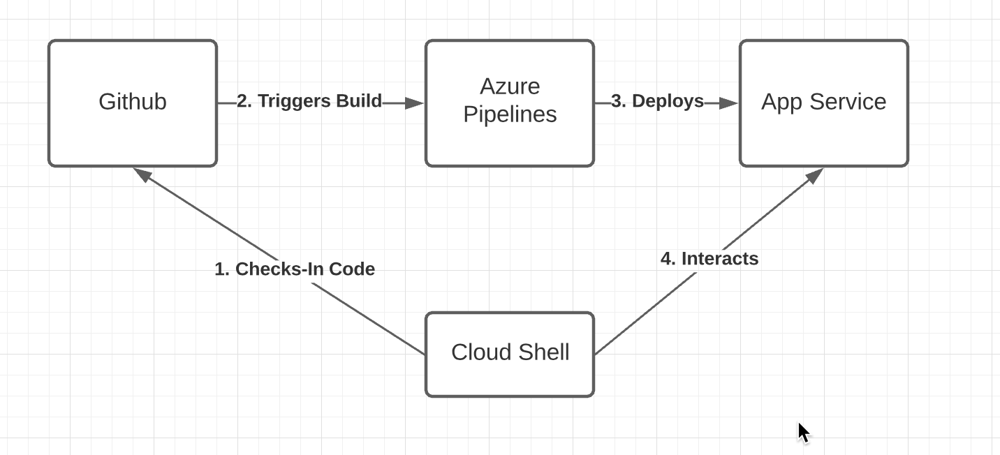
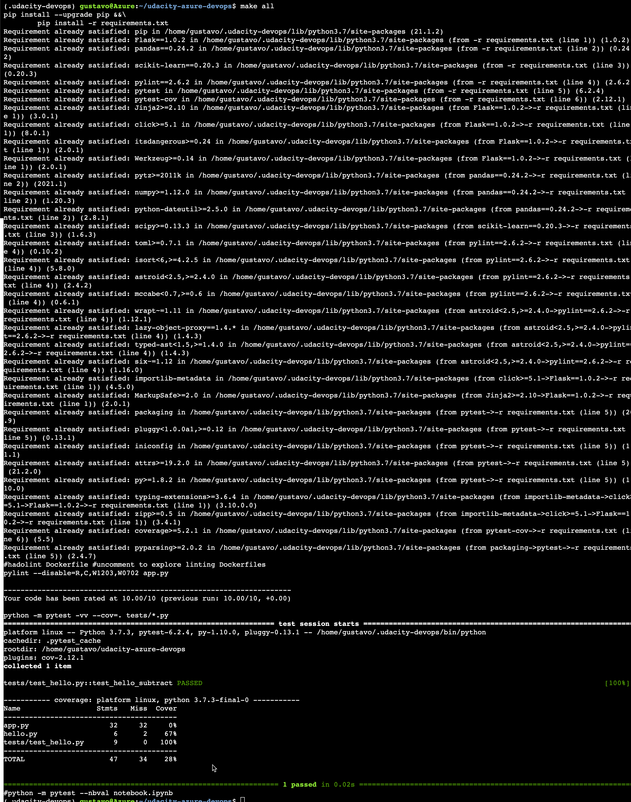

# Overview

The project deploys a Machine Learning application that predicts house prices in Boston given house attributes, such as house rooms.  The intent of this project is to incorporate Continuous Integration and Continuous Development with Python and Azure DevOps. 

## Project Plan

* A link to a Trello board for the project: https://trello.com/b/OXwAIq3N/ml
* A link to a spreadsheet that includes the original and final project plan> https://docs.google.com/spreadsheets/d/e/2PACX-1vTt4vtQsiF_C0PBh4ODCjn417omVvN1iWzpKynbBROILolDKPzl3tUEDiE8Ss4hoMM8NGUViOTyy37E/pubhtml

## Instructions
 
Architectural Diagram

1. Setup and/or start up the Azure Cloud Shell on Azure Subscription
2. Clone the following Github repository into Cloud Shell instance: https://github.com/gmart009/udacity-azure-devops
3. Go to the local cloned repo in Cloud Shell and run the following command on the shell to setup dev environment with all dependencies and to ensure all tests successfully complete: make all 

4. make changes to app and push changes to Github, at which point the automatic DevOps pipeline will build and test code, as well as deploy build into App Service plan

6. After deployment is complete, you can locally test code by editing the ./make_predict_azure_app.sh file with the app service name.
7. Run the /make_predict_azure_app.sh script and you should see the following output:
Make Prediction Output

Streamed Output

## Enhancements

To improve the project, I would suggest adding tests that ensure predictions stay accurate and also add feedback from users to improve model.  I would also add a staging step in DevOps pipeline to only deploy code after Peer Review.

## Demo

https://youtu.be/UvjDETmIiCw

